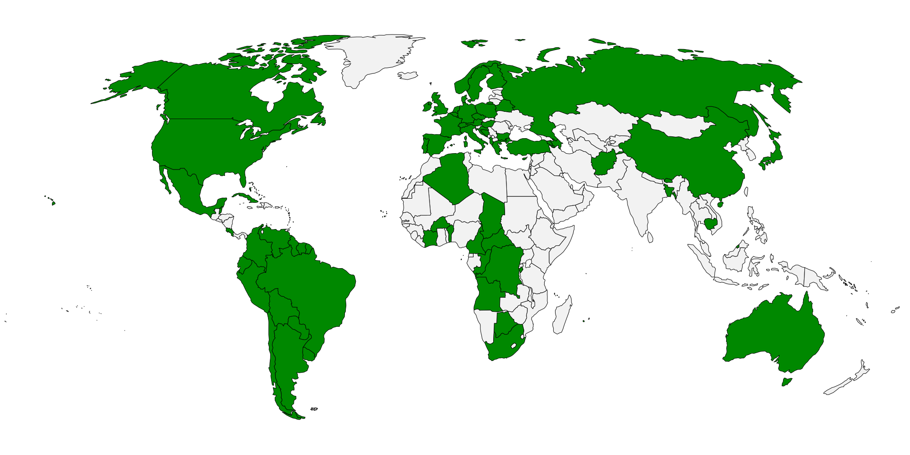

[](https://github.com/heiglandreas/holidayChecker/actions?query=workflow%3ABuild)
[](https://coveralls.io/github/heiglandreas/holidayChecker?branch=main)
[](https://scrutinizer-ci.com/g/heiglandreas/holidayChecker/?branch=main)
[](https://lima.codeclimate.com/github/heiglandreas/holidayChecker)
[](https://www.codacy.com/app/github_70/holidayChecker?utm_source=github.com&amp;utm_medium=referral&amp;utm_content=heiglandreas/holidayChecker&amp;utm_campaign=Badge_Grade)
[](https://insight.sensiolabs.com/projects/36a28cf5-b7e4-474d-bded-8f6b70fa9ea8)

[](https://packagist.org/packages/org_heigl/holidaychecker)
[](https://packagist.org/packages/org_heigl/holidaychecker)
[](https://packagist.org/packages/org_heigl/holidaychecker)
[](https://packagist.org/packages/org_heigl/holidaychecker)


# holidayChecker

Check whether a given date is a holiday - locale-aware

This library allows you to check a single day against one or multiple calendars
to see whether the given day is a holiday or not.

That also includes "named Days" that are not necessarily "free" but have a special
name like "Maundy Thursday".

## Installation

holidayChecker is best installed using [composer](https://getcomposer.org)

```bash
composer require org_heigl/holidaychecker
```

## Usage

Simple usage:

```php
$factory  = new HolidayIteratorFactory();
$iterator = $factory->createIteratorFromXmlFile('path/to/a/holiday/file.xml');
$checker  = new Holidaychecker($iterator);

$result = $checker->check(new \DateTime());
// $result will be an instance of Org_Heigl\HolidayChecker\Holiday
```

$result has 3 methods:

* **isHoliday** is ```true``` when the day is a free day according to the local law. Otherwise it's ```false```
* **isNamed** is ```true``` when the day has a special name despite being not a free day.
* **getName** contains the name of a named day.

You can also get a ```HolidayIterator``` with a 2-letter [ISO 3166-1](https://en.wikipedia.org/wiki/ISO_3166-1)
or a 4-letter [ISO 3166-2](https://en.wikipedia.org/wiki/ISO_3166-2) code. And when different language-variations are available you can get them
by adding the [ISO 639-1 language-code](https://en.wikipedia.org/wiki/ISO_3166-2) before the ISO 3166-code:

```php
// Get the holidays for mainland france
$iterator = $factory->createIteratorFromIso3166('FR');

// Get the holidays for the french overseas-department La Reunion
$iterator = $factory->createIteratorFromIso3166('FR-RE');

// Get the dutch holidays for belgium
$iterator = $factory->createIteratorFromIso3166('fr_BE');
```

## Available Countries

Currently these countries are available:



* Germany (all Bundesländer, german)
* Luxemburg (german, french and luxembourgisch)
* Belgium (flamisch and french)
* Netherlands (dutch)
* France (Mainland and overseas, adaptions for Elsass/Lothringen, french)
* United Kingdom (Islands, Wales, Scotland, Northern Ireland and England, englisch)
* Finland
* Russia
* Greece
* Turkey
* South Africa (english)
* Ireland (english and irish)
* Spain (all provinces, spanish)
* Portugal (mainland, Madeira and Azores, portuguese)
* Denmark (danish)
* Sweden (swedish)
* Norway (bokmål)
* Poland (polish)
* Austria (german)
* Italy (italian)
* Canada (french and english)
* United States (Federal holidays only - english)
* Brazil (brazilian portuguese)
* Japan (needs better way to handle Equinoxes)
* Chinese (Needs better way to handle solar terms)
* Afghanistan (english)

But the list is constantly extending.

## Extending

Currently not all countries holidays are available. We are trying to fix that
but you might find that exactly the country you need is missing.

As the holidays are retrieved from XML-files you can add your own ones without
issue. They need to correspond to the [Schema-file](https://github.com/heiglandreas/holidayChecker/blob/master/share/holidays.xsd)
and before the schema is checked any XInclude-statements are executed.

You can then load the holidays from your file using the ```createIteratorFromXmlFile```-method.

If you think the XML-files might be usefull for others you should think about
contributing back and open a PullRequest here or attach them to an issue you open.

We'd be very thankfull!

## Comparison

The main other library in the PHP-ecosystem that also provides holiday-calendars
is the [Yasumi-library](https://packagist.org/packages/azuyalabs/yasumi). There are some
differences between those two libraries though that I want to highlight here.

The main difference is that Yasumi is a purely programatical library. The holidays and their rules are
written down in code. Extending the library by adding new calendars or modifying existing ones to own requirements
requires actual coding. Contrary to that in this library the actual data is provided in XML-files. SO adding new
calendars or extending existing ones requires one to create a new or modify an existing XML-file. Whether that is easier
that doing PHP-programming is up to the user to decide.

Besides that Yasumi uses pre-calculated dates for holidays that are based on a non-gregorian calendar like
for islamic, jewish or lunar-based holidays. This library on the other side defines holidays based on the
day in a certain calendar. For that we use the ICUs calendars under the hood which allows us to declare holidays based
on the buddhist, chinese, coptic, ethiopian, hebrew, indian, islamic, japanese and persian calendar.
For the islamic calendar we support different versions of day-calculation, mainly the astronomical and the civilian
calendar. Both libraries have their issues when a calendaring system is used, that is based on an actual person
observing something like the islamic calendar used in Saudi-Arabia. As these calendars are based on visual observation
they can not be precalculated and therefore not be used with a precalculating library.

Given this difference the Yasumi-Library currently only allows usage of dates between 1949 and 2050 whereas this library
is free in the daterange to be used.

Another difference are the requirements. While Yasumi only requires a PHP of up to PHP7.4 with the JSON extension
available this library requires the DMO-extension (XML) as well as the INTL-extension as we are using that to calculate
holidays based on different calendaring systems. This library also requires a library to compare dateintervals which is
used in the calculation of the easter-date.


